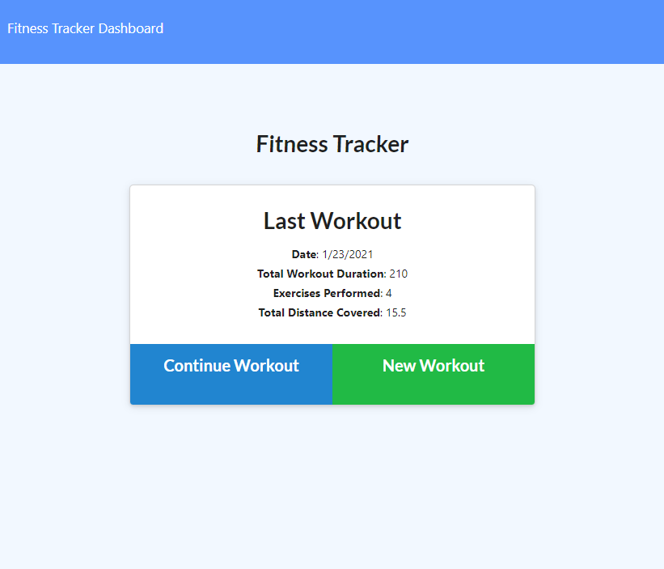

# Fitness Tracker

## Description
This is a workout tracker. It tracks the user's workouts and the exercises they did while working out. It store the information in a mongoDb. You can view the stats and a summary of all of your workouts.

[Live Demo](https://workout-tracker-uofu.herokuapp.com/)
[Github URL](https://github.com/HeavensRegent/nb-w17-homework)

## Table of Contents
* [Installation Instructions](<#installation-instructions>)
* [Usage Information](<#usage-information>)
* [Collaborators](<#collaborators>)
* [Contribution Guidelines](<#contribution-guidelines>)
* [Test Instructions](<#test-instructions>)
* [License](<#license>)
* [Questions](<#questions>)

## Installation Instructions
npm i; npm run seed;

## Usage Information
To run the project run `npm start`

## Collaborators
[https://github.com/HeavensRegent](https://github.com/HeavensRegent)

## Contribution Guidelines
Forking and pull requests

## Test Instructions
None

## License
MIT License

## Questions
View my Github Profile at [https://github.com/HeavensRegent](https://github.com/HeavensRegent)

Contact me at blstarwars1@gmail.com
